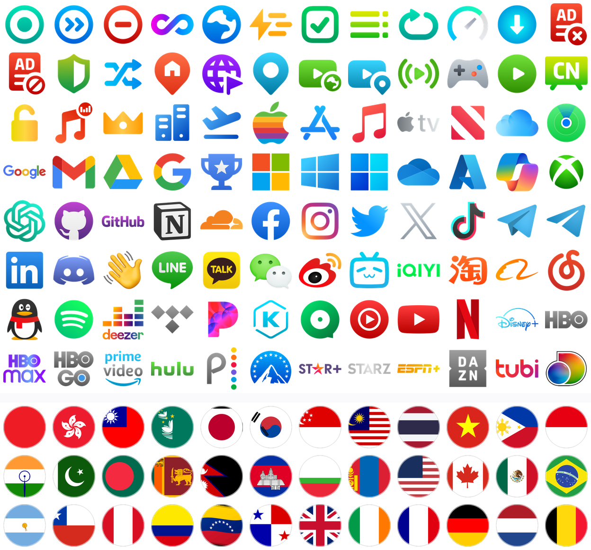

# Stash 彩色图标集

给 **Stash** 用的策略组图标集：主流国内外网站彩色图标 + 主流国家国旗。

| 内容 | 数量 | 规格 |
|---|---|---|
| 网站 / 功能图标 `icons/` | **177** | 144×144 PNG，透明底 |
| 国旗（圆形） `flags/` | **89** | 144×144 PNG，透明底 |
| 国旗（圆角方形 4:3） `flags-square/` | **89** | 144×144 PNG，透明底 |
| 地区代码徽标 `regions/` | **25** | 144×144 PNG，透明底 |
| **合计** | **380** | 全部 144×144 RGBA |

配色与画质对齐社区事实标准 **Qure Color**（**Stash 自带的 `default.yaml` 官方示例就用它**），
另有 51 个图标由 **simple-icons** 矢量按官方品牌色补齐。



---

## 一、先拿到「图标集 URL」

Stash 里只能填 **URL**，不能填本地路径。

> ### 📱 iPhone 用户直接用方案 B（jsDelivr）
>
> 本机 Mac 托管（方案 A / A+）只在家里同一 Wi-Fi、且 Mac 不休眠时有效。
> iPhone 会移动，**真正需要的是公网 URL**。已配置好的地址是：
>
> ```
> https://cdn.jsdelivr.net/gh/Xiaohu-Guoguo/stash-icons@main/icons-zh.json
> https://cdn.jsdelivr.net/gh/Xiaohu-Guoguo/stash-icons@main/icons.json
> ```
>
> 备用域名（万一 cdn.jsdelivr.net 不通）：
>
> ```
> https://fastly.jsdelivr.net/gh/Xiaohu-Guoguo/stash-icons@main/icons-zh.json
> ```
>
> 仓库推上去之前这些地址会 404。见下方方案 B。

### 方案 A：本地 HTTP（仅临时验证）

```bash
bash tools/serve.sh          # 默认 8787 端口
```

拿到：

```
http://127.0.0.1:8787/icons.json      ← 图标集地址
http://127.0.0.1:8787/icons-zh.json   ← 中文名优先版（推荐，可在 Stash 里搜中文）
```

> ⚠️ **iPhone / iPad 上不能用 `127.0.0.1`**，那指向手机自己。
> 要让 iOS 版 Stash 用，得换成 Mac 的局域网 IP 或 Bonjour 主机名，见下方「方案 A+」。

### 方案 A+：本机常驻 + Bonjour 主机名 ★ 当前采用的方案

局域网 IP 由 DHCP 分配，路由器重启后会变；用 **Bonjour 主机名**就没有这个问题，
而且 iOS 原生支持 `.local` 域名解析。

```
http://jihudeiMac.local:8787/icons-zh.json
```

（`jihudeiMac` 是本机 `scutil --get LocalHostName`，换机器请自行替换）

**装成开机自启服务**（推荐，一次搞定）：

```bash
bash tools/install-service.sh
```

装好后会：开机/登录自动启动、进程崩溃自动拉起、无需保持终端开着。
服务用的 `/usr/bin/python3` 已在 macOS 防火墙放行名单内，不会被拦。

卸载：

```bash
bash tools/uninstall-service.sh
```

> 该脚本需要写入 `~/Library/LaunchAgents/`，属于系统目录，
> **必须在自己的终端里执行**（沙箱内无法代劳）。

**为什么不直接用 `python -m http.server`**：它是单线程的。
实测 Stash 并发拉取图标时，16 并发会有 43 个请求被 `Connection reset by peer`；
本项目自带的 `tools/server.py` 用 `ThreadingHTTPServer` 并放大 accept 队列，
**24 并发 289 个请求 0 失败**，同时按类型设置了缓存头（图片 1 天、JSON 5 分钟）。

**唯一的硬限制：Mac 休眠时服务会暂停。**
长期挂机请在「系统设置 → 锁定屏幕」里把「无操作时进入睡眠」设为「永不」，
或保持接通电源。若无法保证 Mac 常开，请改用方案 B（jsDelivr）。

#### 两个已知的排查陷阱

**1）在 Mac 上用 Python/浏览器访问 `.local` 可能报 `502 Bad Gateway`，但这不是服务的问题。**
本机系统代理（`设置 → 网络 → 代理`）如果开着，Python 的 `urllib` 和浏览器会把 `.local`
请求也发给代理，而代理无法解析 `.local` 主机名。`curl` 不读系统代理，所以用 `curl` 测试是正常的。

验证时请显式绕过代理：

```bash
curl --noproxy '*' http://jihudeiMac.local:8787/icons-zh.json
```

**2）iPhone 上不会有这个问题。** Stash 的默认 `skip-proxy` 列表里明确包含
`*.local`、`localhost` 以及 `10.0.0.0/8`、`172.16.0.0/12`、`192.168.0.0/16`、`127.0.0.0/8`
等全部私有网段——即 Stash 的 TUN 会**绕过代理直连**图标集地址。

### 方案 B：GitHub + jsDelivr（真正的长期方案，不依赖 Mac 开机）

#### 第 1 步：创建公开仓库

1. 打开 <https://github.com/new>
2. **Repository name** 填 `stash-icons`
3. 选 **Public** ← 必须，jsDelivr 只服务公开仓库
4. **不要**勾选 `Add a README file` / `.gitignore` / `license`，保持空仓库
5. 点 **Create repository**

#### 第 2 步：创建访问令牌（PAT）

GitHub 早已禁止用账号密码推送，必须用令牌。

1. 打开 <https://github.com/settings/tokens> → **Tokens (classic)** → **Generate new token (classic)**
2. **Note** 填 `stash-icons push`
3. **Expiration** 选 90 天（或 No expiration，安全自负）
4. **勾选 scope：`repo`** ← 必须
5. 点 **Generate token**
6. **立刻复制**那串 `ghp_...`，离开页面就再也看不到

#### 第 3 步：推送

```bash
cd ~/Documents/deepseek-harness/default-workspace/stash-icons
git remote add origin https://github.com/Xiaohu-Guoguo/stash-icons.git
git push -u origin main
```

提示凭据时：

```
Username for 'https://github.com': Xiaohu-Guoguo
Password for 'https://Xiaohu-Guoguo@github.com': ← 粘贴 ghp_ 令牌后回车
```

> **粘贴令牌时屏幕不显示任何字符，这是正常的。** 不要输账号密码，密码一定会被拒。

推送成功后建议存进钥匙串，以后不用重复输入：

```bash
git config --global credential.helper osxkeychain
```

> 推送卡住的话（直连 GitHub 不稳），借本机已有的代理：
> ```bash
> git config http.proxy http://127.0.0.1:7890
> git push -u origin main
> git config --unset http.proxy     # 推完可撤掉
> ```

推送后自检（会真的把图标 URL 请求一遍，而不只看 JSON 能不能下载）：

```bash
python3 tools/verify-online.py            # 抽样 40 条，几秒
python3 tools/verify-online.py --all      # 全量 1156 条
```

拿到：

```
https://cdn.jsdelivr.net/gh/<你的用户名>/<仓库名>@main/icons.json
```

> jsDelivr 首次访问会回源缓存，可能慢几秒；之后走 CDN。
> 仓库更新后 jsDelivr 有缓存延迟，可在 URL 里改用具体 commit hash 强制刷新。

### 方案 C：GitHub Pages

```bash
python3 tools/rebase.py --base-url https://<你的用户名>.github.io/<仓库名>/
```

然后在仓库 Settings → Pages 里开启（Source 选 `main` / 根目录）。

> 注意：GitHub Pages 在部分网络环境下不稳定，长期使用建议方案 B。

---

## 二、在 Stash 里怎么用

### 用法 1：输入「图标集 URL」（iOS 版）

> **平台差异（已实测确认）**：图标集 URL 导入是 **iOS / iPadOS 版独有**的功能。
> 检查本机 `Stash.app`（macOS）二进制：不存在 `icons` / `iconSet` 相关符号，
> 本地化文件中也没有 `json` / `导入` 文案，`Documents/local/images` 目录为空。
> 因此 **macOS 版请直接用下面的「用法 2」写 `icon:` 字段**；iOS 版用「用法 1」。
> 另外 iOS 版必须用**局域网 IP**，`127.0.0.1` 指向手机自己。

在 Stash 的图标集设置里，填入上面拿到的 JSON 地址：

```
http://192.168.x.x:8787/icons-zh.json
```

JSON 结构如下（社区通用 schema，Qure / mini 等主流图标集均为此格式）：

```json
{
  "name": "Stash 彩色图标集",
  "description": "主流国内外网站彩色图标…",
  "icons": [
    { "name": "YouTube",  "url": "http://127.0.0.1:8787/icons/YouTube.png" },
    { "name": "知乎 Zhihu", "url": "http://127.0.0.1:8787/icons/Zhihu.png" }
  ]
}
```

- `icons.json` → `name` 为英文名，适合按英文搜索
- `icons-zh.json` → `name` 为「中文名 英文名」，适合在 Stash 里**直接搜中文**（如「香港」「哔哩哔哩」）

> 若导入后列表为空：先确认该 URL 在手机浏览器里能打开并返回 JSON。
> 手机端务必用局域网 IP，不要用 `127.0.0.1`。

### 用法 2：直接在配置里写 `icon:` 字段

Stash 官方支持在 `proxy-groups` 里给每个策略组指定 `icon`（值为图片 URL，支持 PNG / JPG）：

```yaml
proxy-groups:
  - name: 🚀 节点选择
    type: select
    icon: http://127.0.0.1:8787/icons/Proxy.png
    proxies: [DIRECT]

  - name: 🇭🇰 香港节点
    type: url-test
    icon: http://127.0.0.1:8787/flags/hk.png
    url: http://www.gstatic.com/generate_204
    interval: 300

  - name: 🛑 广告拦截
    type: select
    icon: http://127.0.0.1:8787/icons/AdBlack.png
    proxies: [REJECT, DIRECT]
```

现成片段已生成好，直接抄：

| 文件 | 用途 |
|---|---|
| `stash/icon-groups.yaml` | 20 个常用策略组 + 8 个地区分组，含 `icon` 字段 |
| `stash/override-example.yaml` | 覆写（Override）示例，给订阅里的策略组自动挂图标 |
| `stash/clash-meta-example.yaml` | Clash Meta / mihomo 示例（Dashboard 支持 `icon`） |

> 换过托管地址后，这三个文件里的 URL 会由 `tools/rebase.py` 自动同步更新。

### 圆形 vs 圆角方形国旗

- `flags/hk.png` —— 圆形，和 Qure 的圆形图标风格统一
- `flags-square/hk.png` —— 圆角方形 4:3，最接近真实国旗，旗面内容不会被裁掉

两套内容完全一致，按喜好混用即可。

---

## 三、目录结构

```
stash-icons/
├── icons.json              ← 图标集（英文名，291 条）
├── icons-zh.json           ← 图标集（中文名优先，291 条）★ 推荐
├── icons-index.json        ← 富索引：分类 / 中文别名 / 来源 / 方形国旗地址
├── preview.png             ← 总览预览图
├── README.md / NOTICE.md
├── icons/         177 个网站与功能图标
├── flags/          89 个圆形国旗
├── flags-square/   89 个圆角方形国旗
├── regions/        25 个 Qure 地区代码徽标（CN/HK/TW/US…）
├── stash/           三个可直接抄的 YAML 片段
└── tools/
    ├── manifest.py     ★ 图标清单（唯一数据源，改这里）
    ├── build.py          重新构建全部产物
    ├── rebase.py         一键切换托管地址
    ├── add_icon.py       添加你自己的图标
    ├── server.py         常驻静态服务（多线程 + 缓存头）
    ├── serve.sh          前台快速起服务
    ├── install-service.sh   装成开机自启（launchd）
    └── uninstall-service.sh 卸载自启服务
```

---

## 四、图标覆盖

### 网站与功能（177 个，26 个分类）

| 分类 | 代表图标 |
|---|---|
| 策略组（29） | 直连、代理、拒绝、兜底、全球、自动选择、故障转移、负载均衡、广告拦截、域名劫持、国内/国外媒体、流媒体、游戏、解锁、音乐解锁、VIP、机场… |
| 流媒体（18） | Netflix、Disney+、HBO / Max / GO、Prime Video、Hulu、Peacock、Paramount+、Star+、STARZ、ESPN+、DAZN、Tubi、discovery+、Vimeo、YouTube、Crunchyroll |
| 社交媒体（17） | Facebook、Instagram、X / Twitter、TikTok、Telegram、WhatsApp、Reddit、Pinterest、Snapchat、Signal、Discord、LinkedIn、LINE、KakaoTalk… |
| 国内站点（17） | 哔哩哔哩、爱奇艺、淘宝、微博、微信、知乎、小红书、百度、快手、豆瓣、美团、小米、华为、携程、阿里巴巴、网易云音乐、QQ |
| 欧美电视（9） | BBC iPlayer、ITV、My5、Channel 4、FOX、NBC、NBA、PBS、Yahoo |
| 亚洲媒体（8） | niconico、AbemaTV、AfreecaTV、巴哈姆特、KKTV、Viu、ViuTV、WeTV |
| 苹果（7） | Apple、App Store、Apple Music / TV / News、iCloud、查找 |
| 微软（7） | Microsoft、Windows / 11、OneDrive、Azure、Copilot、Xbox |
| 开发工具（7） | GitHub、Notion、Figma、Docker、WordPress、TestFlight… |
| 音乐（7） | Spotify、Deezer、TIDAL、Pandora、KKBOX、JOOX、YouTube Music |
| 电商支付（6） | 亚马逊、PayPal、支付宝、Stripe、Wise、Shopify |
| 谷歌（5） | Google、Gmail、Drive、搜索、意见回报 |
| 人工智能（6） | ChatGPT、Claude、DeepSeek、Anthropic、Perplexity、Hugging Face |
| 游戏（5） | Steam、PlayStation、任天堂、Epic Games、英雄联盟 |
| 隐私工具（5） | ExpressVPN、NordVPN、Proton Mail、Bitwarden、1Password |
| 其他 | 加密货币（币安 / Coinbase / OKX）、操作系统、硬件、教育、云服务、媒体服务器、成人 等 |

### 国旗（89 面 × 2 种款式）

| 区域 | 数量 | 覆盖 |
|---|---|---|
| 欧洲 | 37 | 英法德意西葡荷比卢瑞士奥、北欧四国+冰岛、波捷斯匈罗保、波罗的海三国、乌克兰、俄罗斯、土耳其… |
| 亚洲 | 20 | 中日韩、港澳台、新马泰越菲印尼、印度巴基斯坦孟加拉、斯里兰卡尼泊尔、柬埔寨缅甸蒙古 |
| 美洲 | 10 | 美加墨、巴西阿根廷智利秘鲁哥伦比亚委内瑞拉、巴拿马 |
| 中东 | 9 | 沙特、阿联酋、以色列、卡塔尔、科威特、伊朗、伊拉克、约旦、黎巴嫩 |
| 非洲 | 7 | 南非、埃及、尼日利亚、肯尼亚、摩洛哥、坦桑尼亚、加纳 |
| 大洋洲 / 中亚 / 超国家 | 6 | 澳大利亚、新西兰、哈萨克斯坦、乌兹别克斯坦、欧盟、联合国 |

---

## 五、自己维护

### 增删图标

只改 `tools/manifest.py`（`QURE` / `SI` / `FLAGS` / `REGIONS` 四个列表），然后：

```bash
python3 tools/build.py
python3 tools/rebase.py --base-url <你的地址>
```

### 添加清单外的图标

Qure 和 simple-icons **都没有**收录京东、优酷、腾讯视频、QQ音乐、拼多多、滴滴、高德等品牌
（`dashboard-icons` 也没有）。这类缺口用下面的命令自助补：

```bash
# 从站点自动抓（优先 apple-touch-icon，通常 180×180）
python3 tools/add_icon.py --name 京东 --domain www.jd.com --zh 京东 --category 国内站点 \
        --base-url http://127.0.0.1:8787/

# 或用你自己的高清图（效果最好）
python3 tools/add_icon.py --name 优酷 --file ~/Downloads/youku.png --zh 优酷 \
        --base-url http://127.0.0.1:8787/
```

> 实测多数站点的 favicon 只有 16–57px，放大到 144px 会明显发糊，
> 所以主集没有收录抓取来的图标。**建议自备高清图**，抓取只作兜底。

---

## 六、来源与许可

| 来源 | 许可 | 用途 |
|---|---|---|
| [Koolson/Qure](https://github.com/Koolson/Qure) | ⚠️ **仓库未附 LICENSE** | `icons/` 主体 125 个 + `regions/` 全部 25 个 |
| [simple-icons](https://github.com/simple-icons/simple-icons) | **CC0-1.0** | `icons/` 补充 50 个 |
| [dashboard-icons](https://github.com/homarr-labs/dashboard-icons) | **Apache-2.0** | `icons/` 补充 1 个（罗技） |
| [lipis/flag-icons](https://github.com/lipis/flag-icons) | **MIT** | 国旗 87 面（矢量栅格化） |
| [flagcdn](https://flagcdn.com) | 同源 lipis，MIT | 国旗 2 面（`ve` `tz`，见下） |

**Qure 部分没有开源许可证**，个人自用、自建私有仓库没问题；公开再分发或商用时请自行评估。
详见 [`NOTICE.md`](NOTICE.md)。

### 已知技术问题（已修复，记录备查）

1. **lipis 的 `1x1` 国旗变体不可用**——实测美国国旗星区被放大且丢星、沙特国旗出现异常黑块。
   已统一改用 `4x3` 标准旗面。
2. **macOS `sips` 无法渲染含 `<use xlink:href>` 的 SVG**——导致委内瑞拉 (`ve`) 渲染成空白、
   坦桑尼亚 (`tz`) 渲染成近黑。构建脚本已加入自动检测（近白/近黑像素占比 > 92% 判为失败）
   并回退到 flagcdn 的 256×192 PNG。塞浦路斯是白底旗（近白 76%），不会被误判。
3. **国旗白色区域在白底上会消失**（日本、法国等）——已给所有国旗加 0.6% 半透明黑描边解决。
